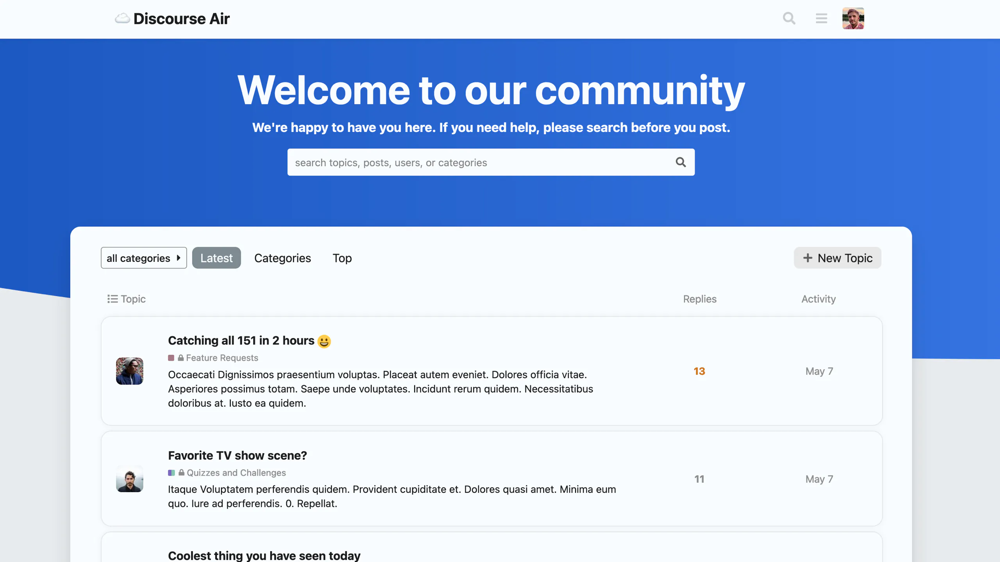
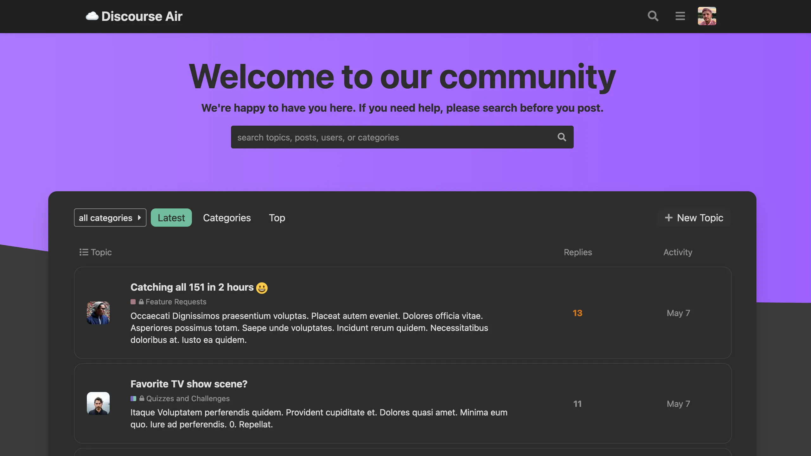
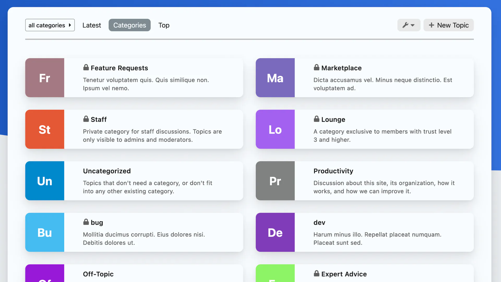
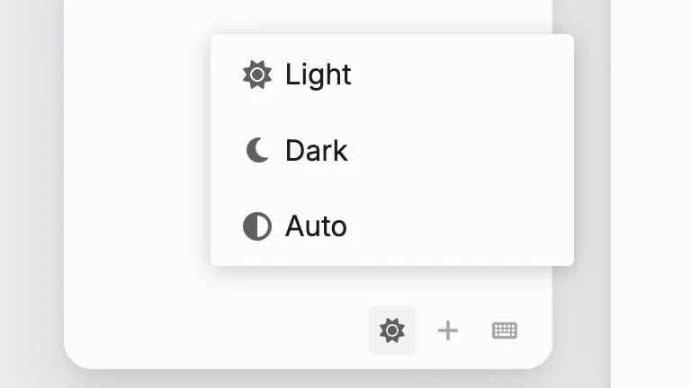
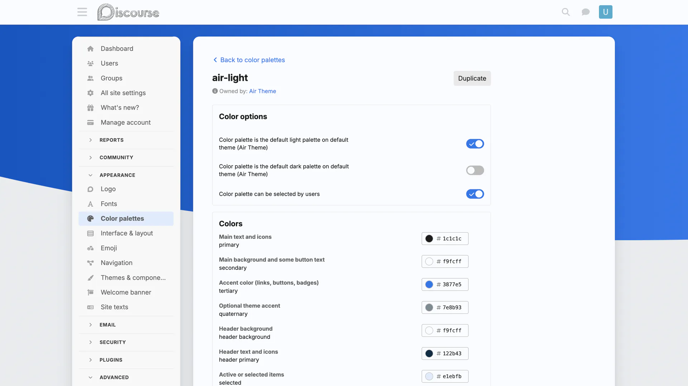
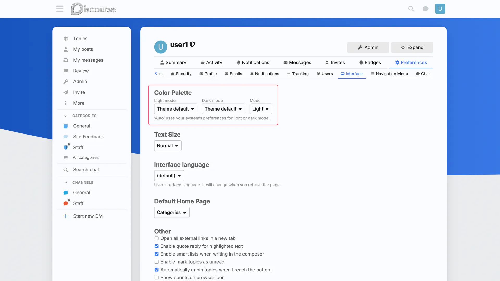
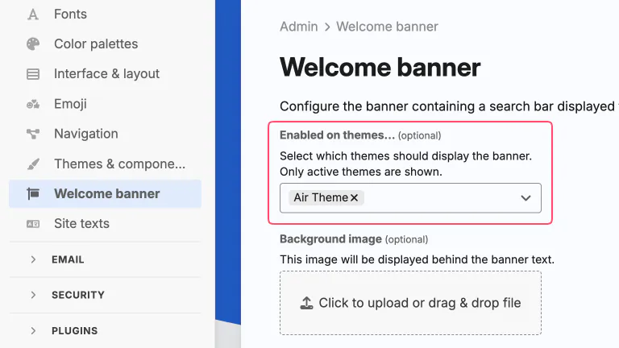
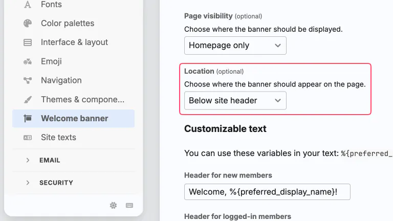
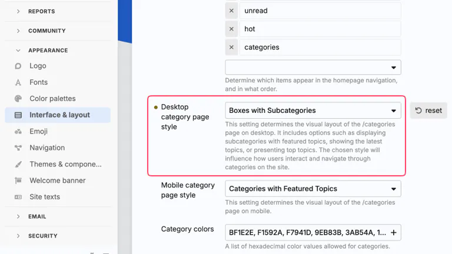

A clean & modern theme with a couple of theme components included to enhance your forum!

**Light Mode**

**Dark Mode**

**Categories Page**

This theme includes a couple of theme components to enhance your forum, as well:

- [Clickable Topics](https://meta.discourse.org/t/clickable-topic/183339)
- [Modern Category + Group Boxes](https://github.com/discourse/discourse-minimal-category-boxes)

---

## Theme configuration

> :exclamation: Please follow theme configuration tips upon installation, as there are a couple of settings that **NEED TO BE ENABLED** for this to theme to render properly.

### Dark Light Mode Toggle

The mode toggle (image above) will be shown at the bottom of sidebar, once at least 2 color palette choices are enabled on the **Color palettes** admin page (`/admin/config/colors`). At least two colors need to have `Color palette can be selected by users` enabled:

Once this is done, users should be able to choose between two color palettes as their `light` and `dark` preferences in their user preferences interface page (`/my/preferences/interface`):

### Edit Theme

Go to **Admin > Themes & components** (`/admin/config/customize/themes`) page to edit Air theme.

- in **Dark color palette** dropdown select `air-dark`

  

## Welcome Banner

Go to **Admin > Welcome banner** (`/admin/config/welcome-banner`) page.

- in **Enabled on themes...** dropdown select `Air Theme`

  

- in **Location** dropdown select `Below site header`

  

## Modern Category + Group Boxes

Go to **Admin > Interface & layout** (`/admin/config/interface`) page.

- in **Desktop category page style** dropdown select `Boxes with Subcategories`

  

This theme component allows the forum admin to organize their category page with header titles, and choose which categories appear under each header. To keep things simple, up to 5 headings are allowed to be used. **If no categories + heading settings are chosen, all categories will render as they do above, this is the default rendering option.**

---

Feel free to post any issues here :grinning_face_with_smiling_eyes:

I hope you enjoy!

|                     |                              |                                                                                                                             |
| ------------------- | ---------------------------- | --------------------------------------------------------------------------------------------------------------------------- |
| :eyeglasses:        | **Preview**                  | https://discourse.jordanvidrine.com/                                                                                        |
| :hammer_and_wrench: | **Repository**               | https://github.com/discourse/discourse-air.git                                                                              |
| :question:          | **Install Guide**            | [How to install a theme or theme component](https://meta.discourse.org/t/how-do-i-install-a-theme-or-theme-component/63682) |
| :open_book:         | **New to Discourse Themes?** | [Beginner’s guide to using Discourse Themes](https://meta.discourse.org/t/beginners-guide-to-using-discourse-themes/91966)  |
